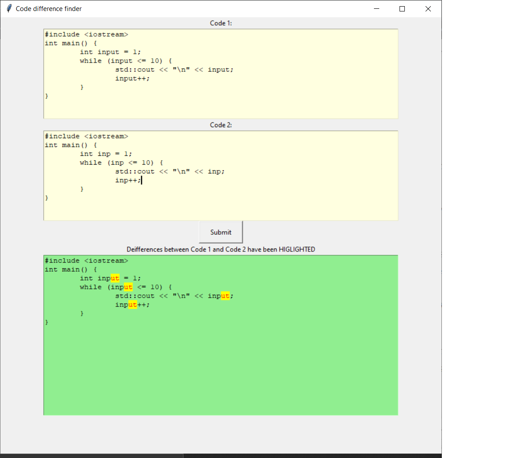

# Code difference finder

Python application to find effective differences between any two sorce codes and highlight them.

This is inspired from the diff features available on Github and LeetCode
Below is a screeshot showing its operation.

